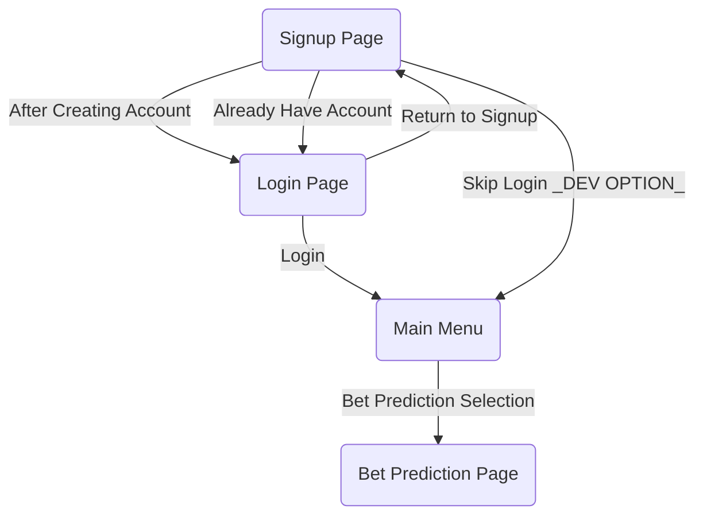

# CSC207 Project
1) The problem domain that our team is working on is Finance and Sports, specifically sports betting in the NBA.
2) We would like to create an application predicting which team is more likely to win the match, and for the users to bet accordingly.
4) Documentation of the API we will use: https://polygon.io/docs/stocks/getting-started
5) Using GET command on the API to view information on AAPL stock using Postman:

 
7) Technical difficulties include :
     
     

Google Docs: [https://docs.google.com/document/d/1N5nsbEesMaH2Lt44tMoVu_1xxssDknp3evipAFkdZdE]

UI Diagram
