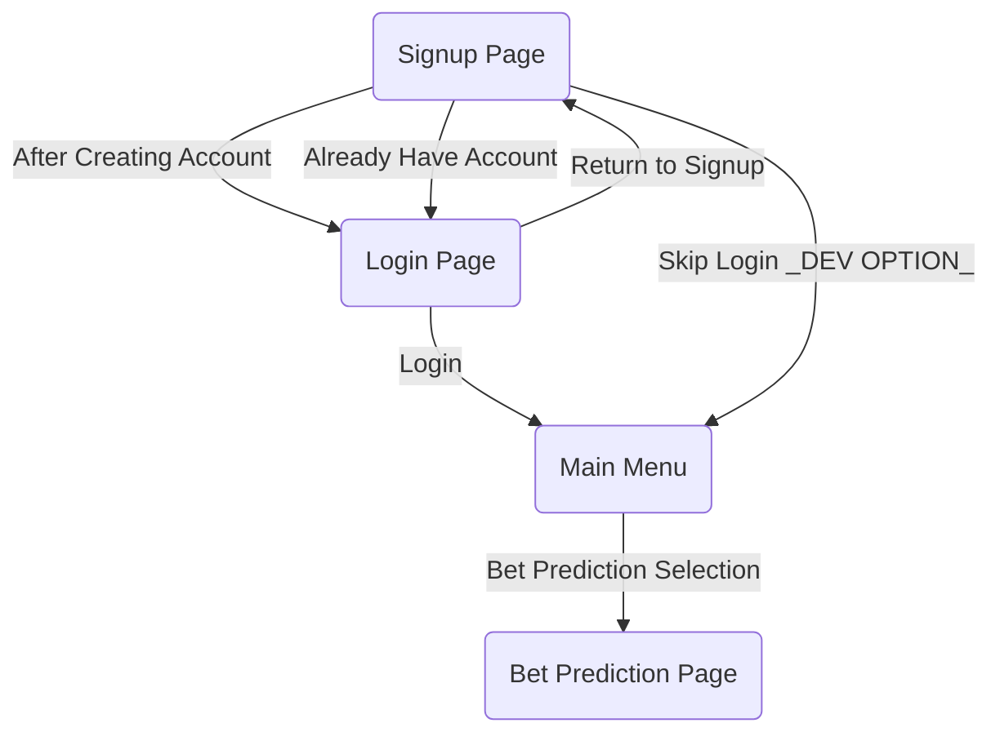

# CSC207 Project
1) The problem domain that our team is working on is Finance and Sports, specifically sports betting in the NBA.
2) We would like to create an application predicting which team is more likely to win the match, and for the users to bet accordingly.
4) Documentation of the API we will use: https://polygon.io/docs/stocks/getting-started
5) Using GET command on the API to view information on AAPL stock using Postman:

 
7) Technical difficulties include :
     
     

Google Docs: [https://docs.google.com/document/d/1N5nsbEesMaH2Lt44tMoVu_1xxssDknp3evipAFkdZdE]

UI Diagram

Calculations:

Per team -> predict which (of 2 teams) is more likely to win a match
1. Look for both teams' id by using "full_name" or "name" (refer to team .json on API documentation page)
2. Look for both ids in stats .json in API doc (going through each page)
3. Take point differential in terms of one team id
   4. it's fine for it to be negative, since we'll be doing bet prediction in 
   terms of that team.
5. take average of point differential
6. if point differential < 0, unlikely to win, if point diff > 0, likely to win,
if point diff = 0, then fair game for either team.
7. can also make predictions of how large of a point differential (separate feature)
- additional feature (tbd): home vs visitor as a factor to take into consideration for prediction

Per player (separate feature) -> place bets on range of points player is going to get during a given game (or type of shot??)
1. "get a specific player" under "players" (API doc)
2. use their name to find their team's id (check if part of name is in, search for id)
3. take "pts" for corresponding player across all games (refer to stats in API doc)
4. take avg pts for how many they are likely to get
   5. alternative -> separate # of pts into ranges that are most common per player, then sort the player's pts into each category and taking probability of each to occur?
   6. note: general, start w/ mean
7. higher or lower than user-given number (more likely to be higher or lower than x value) -> direct comparison w/ given stats